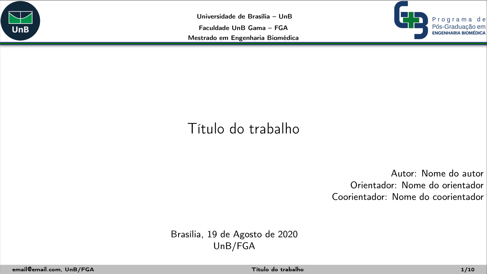

# _Template_ LaTeX para apresentações do PPGEB

Este é um _template_ não oficial para apresentações de _slides_ desenvolvido em LaTeX
para apresentações do PPGEB - UnB (Programa de Pós-Graduação em Engenharia Biomédica -  Universidade de Brasília).

O _template_ inclui exemplos de figuras, tabelas e citações.

O original pode ser encontrado [aqui](https://github.com/ithallojunior/Template_Slides_LaTex).

# 
